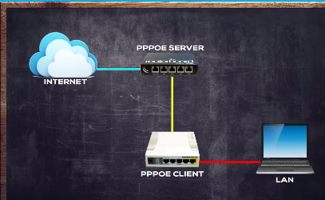
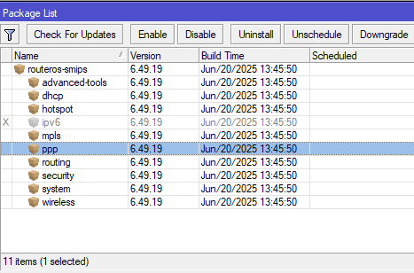
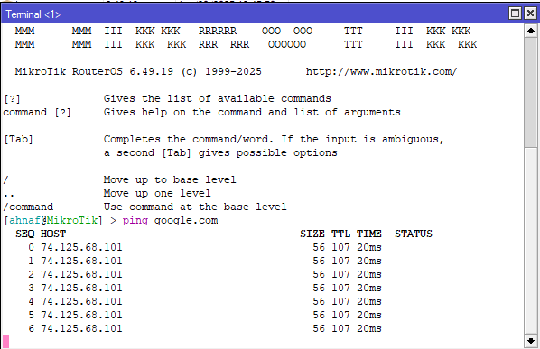
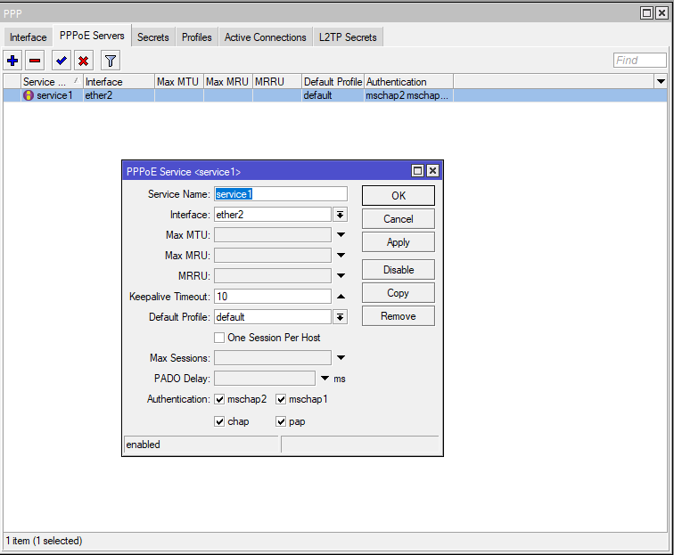
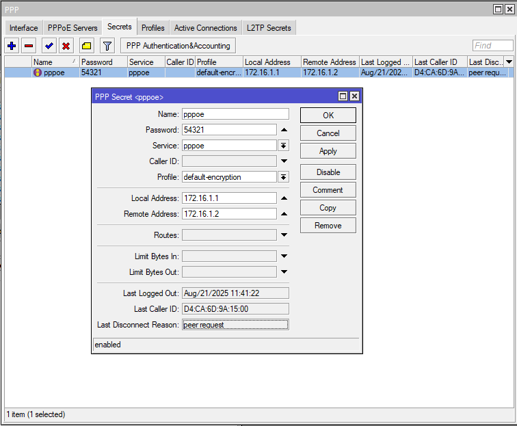
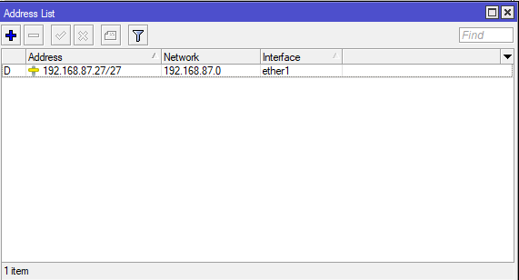
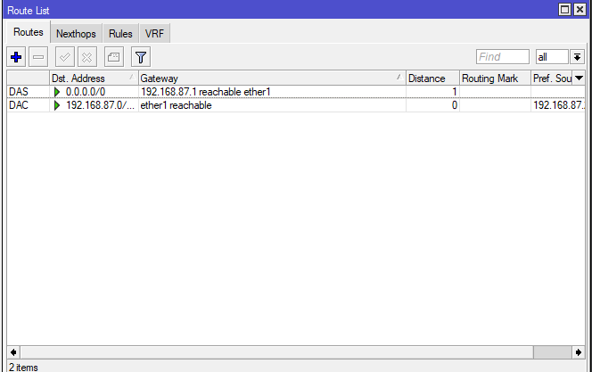

# LAB-37-PPPEO-Point-to-Point-Protocol-over-Ethernet
Kamis 21 Agustus 2025  
  
# Point-to-Point-Protocol-over-Ethernet  
  PPPOE merupakan sebuah protokol yang mengenkapsulasi frame ke PPP ke dalam Frame ethernet mengunakan MAC Address perangkat. Protokol ini sering digunakan di kalangan ISP untuk mendistribusikan koneksi internet ke pelanggan karna dianggap lebih aman karna selain menggunakan metode autensikasi username dan password untuk bisa terkoneksi, protokol PPPOE juga melakukan enkripsi untuk setiap transaksi data yang dilakukan. PPPOE server juga dapat mendistribusikan alamat IP ke perangkat PPPOE Client secara otomatis layaknya DHCP server melalui koneksi layer2 seperti ethernet, Wire;ess, Fiber OPtik bahkan interface bridge dan juga Tunnel seperti EoIP dan juga VLAN. Kita dapat membuat system database username yang terpusat dengan menafaatkan Radius Server atau pada Mikrotik biasa disebut dengan usermanager. Sehingga kita bisa menangani jumlah user Client yang sangat banyak dengan mudah.  

# Konfigurasi PPPOE Server  
  
  
1. Pertama yang harus dipastikan adalah anda harus sudah menginstall package **PPP**, kita bisa cek di **system > packages**.  
  
2. Selanjutnya sebelum mengkonfigurasi PPPOE ini kita perlu melakukan basic config terlebih dahulu sampai Mikrotik terhubung ke internet. Lalu nanti kita bisa sebar koneksi menggunakan PPPOE. Disini saya sudah melakukan basic konfig.  
  
3. Jika sudah, sekarang kita bisa ke ***PPP > PPPOE Server > add**  
4. Tentukan interface mana yang akan aktif, kemudian Service Name, bisa kita tentukan, kemudian pada authentication, pilih sesuai kemampuan perangkat Client kita, Jika sudah Plly dan OK.  
  
5. Jika sudah sekarang kita perlu membuat secret, di **PPP > Secret > add**  
  
6. Pada server ini, saya tidak menambahkan alamat ip di address, tidak ada route ke client, karna yang perlu diperhatikan adalah perangkat Server dan Client bisa terkoneksi menggunakan layer 2, karna proses dari PPPOE ini akan memanfaatkan MAC Address perangkat.  
  
  

# Konfigurasi PPPOE Client
